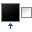
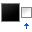
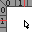
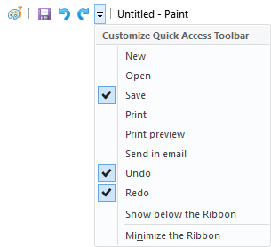
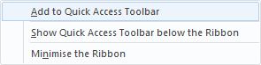
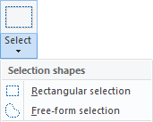
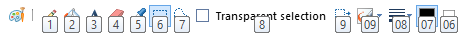

# My AutoHotKey Scripts
This is a collection of all of my AHK Scripts

For all of these you have two download options:
- The .ahk file itself which you can modify yourself to your own preferences.\
You'll need [the AutoHotKey software](https://www.autohotkey.com/) to be able to use these.
- Pre-compiled\
You won't need AutoHotKey for these, as they're just normal .exe files that you can run. These cannot be customised, but they do come with a fun icon!

You might want to put these in your [Start-up folder](link to guide) if you want them to always be running.

## MS Paint Hotkeys
*Made in AutoHotkey Version 1.1.33.09*

This script adds keyboard shortcuts to MS Paint.\
These keyboard shortcuts were vaguely inspired by [Krita](https://krita.org/) and [Blender](https://blender.org/).

### Custom
These are the hotkeys added by this script

Category | Icon | Function | Keybind
--- | --- | --- | ---
**Selection** | | Rectangular Selection | `Ctrl` + `R`
&nbsp; | | Free-form Selection | `Ctrl` + `Shift` + `R`
&nbsp; | | Toggle Transparent Selection | `Ctrl` + `T`
&nbsp; | | Invert Selection | `Ctrl` + `I`
**Main Tools** | | Pencil | `P`
&nbsp; | | Fill Bucket | `F`
&nbsp; | | Text | `Ctrl` + `T`
&nbsp; | | Eraser | `E`
&nbsp; | | Colour Picker | `C`
&nbsp; | | Brush | `B`
&nbsp; | | Line Tool | `L`
**Size** | | Thinnest Size | `1`
&nbsp; | | Normal Size | `2`
&nbsp; | | Thick Size | `3`
&nbsp; | | Thickest Size | `4`
**Colour Select** | | Select Colour 1 | `Z`
&nbsp; | | Select Colour 2 | `X`
**Assistants** | | Toggle Rulers | `R`
&nbsp; | | Toggle Gridlines | `G`
**Zoom** | | Zoom In | `Ctrl` + `+`
&nbsp; | | Zoom Out | `Ctrl` + `-`
&nbsp; | | Zoom 100% | `Ctrl` + `0`
**Misc** | | Redo | `Ctrl` + `Shift` + `Z`
&nbsp; | | Mirror | `M`

(I drew all of these icons myself in Krita to look similar to the ones in MS Paint, but not the same, due to the licensing.)

### Built-In
These are the hotkeys that are already in MS Paint

Category | Function | Keybind
--- | --- | ---
**File** | New | `Ctrl` + `N`
&nbsp; | Open | `Ctrl` + `O`
&nbsp; | Save | `Ctrl` + `S`
&nbsp; | Save As | `F12`
&nbsp; | Undo | `Ctrl` + `Z`
&nbsp; | Redo | `Ctrl` + `Y`
&nbsp; | Print | `Ctrl` + `P`
&nbsp; | Properties | `Ctrl` + `E`
**Clipboard** | Copy | `Ctrl` + `C`
&nbsp; | Cut | `Ctrl` + `X`
&nbsp; | Paste | `Ctrl` + `V`
**Selection** | Select All | `Ctrl` + `A`
&nbsp; | Delete | `Delete`
&nbsp; | Crop image to selection| `Ctrl` + `Shift` + `X`
**Image** | Resize and Skew | `Ctrl` + `W`
&nbsp; | Invert Colours | `Ctrl` + `Shift` + `I`
**Zoom** | Zoom In | `Ctrl` + `PgUp`   `Ctrl` + `ScrollUp`
&nbsp; | Zoom Out | `Ctrl` + `PgDn`   `Ctrl` + `ScrollDown`
&nbsp; | Fullscreen | `F11`
**Misc** | Opens the Paint "Help menu" | `F1`

### Installation and Download
Before you're able to use this script you have to do a tiny bit of set-up first:

First make sure all of these options are ticked **off**:\

Then you have to add the following tools to the Quick Access Toolbar, which you can do by right-clicking the tool in the top bar and selecting "Add to Quick Access Toolbar"\

The order is as follows:
1. Pencil
2. Fill Bucket
3. Text
4. Eraser
5. Colour Picker

**Make sure to add these following selection tools from the drop-down menu and not from the button itself!**\

6. Rectangular Selection
7. Free-form Selection
8. Transparent Selection
9. Invert Selection
10. Brush
11. Size
12. Colour 1
13. Colour 2

So in the end the Quick Access Toolbar should look exactly like this (Press `Alt` to make these numbers appear to verify them):\

**Download**
- [AHK File](https://github.com/TechnicJelle/My-AutoHotKey-Scripts/blob/main/MS%20Paint%20Hotkeys.ahk)
- [Pre-compiled]()
